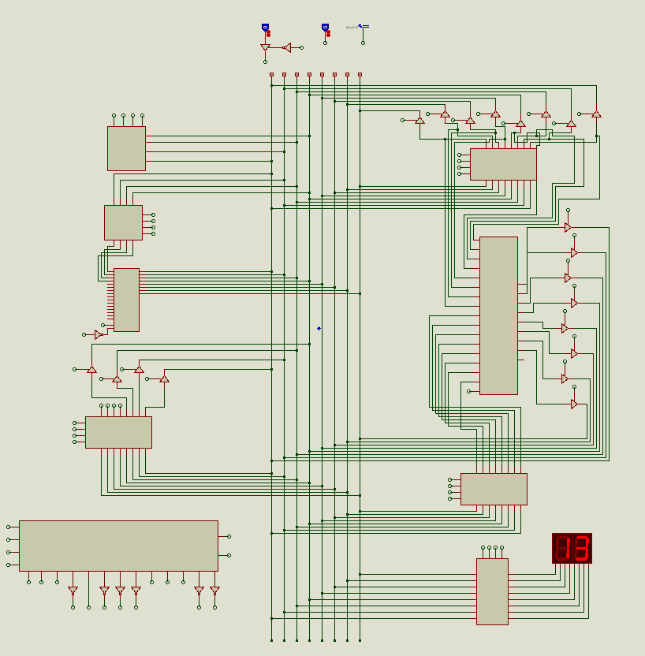
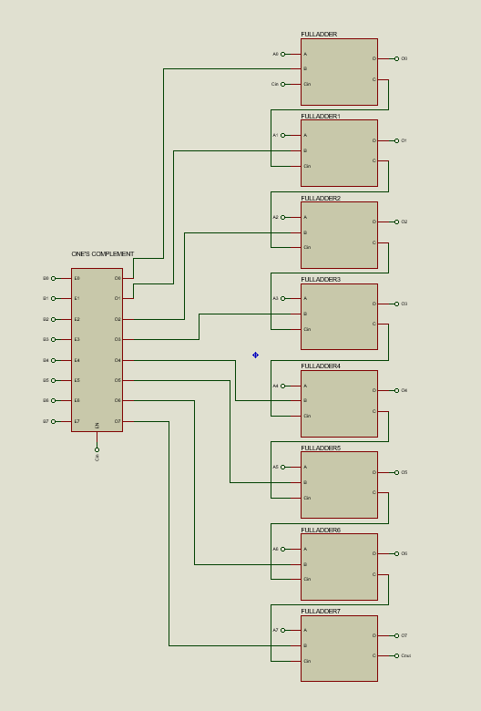
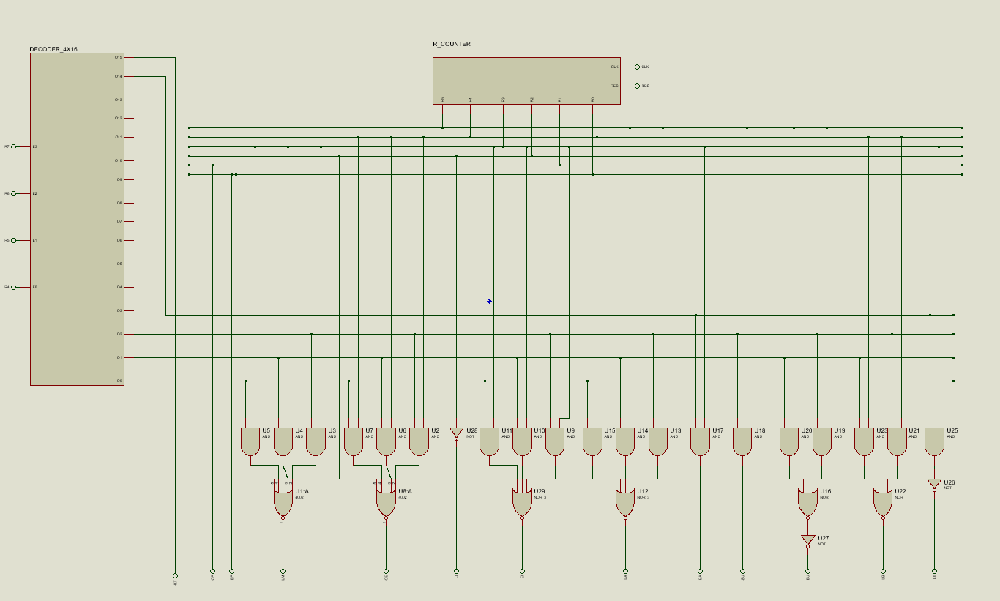
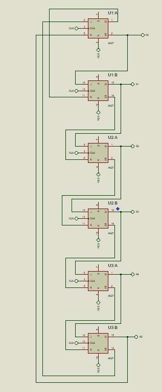
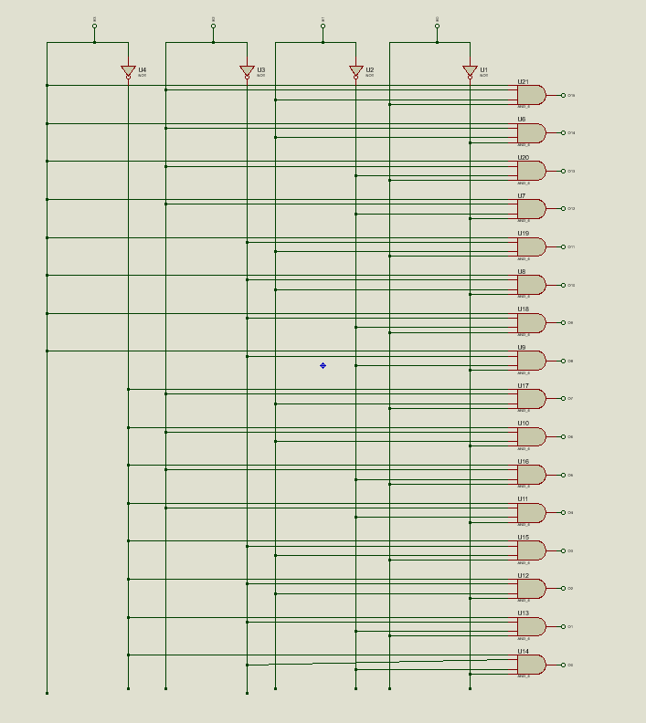
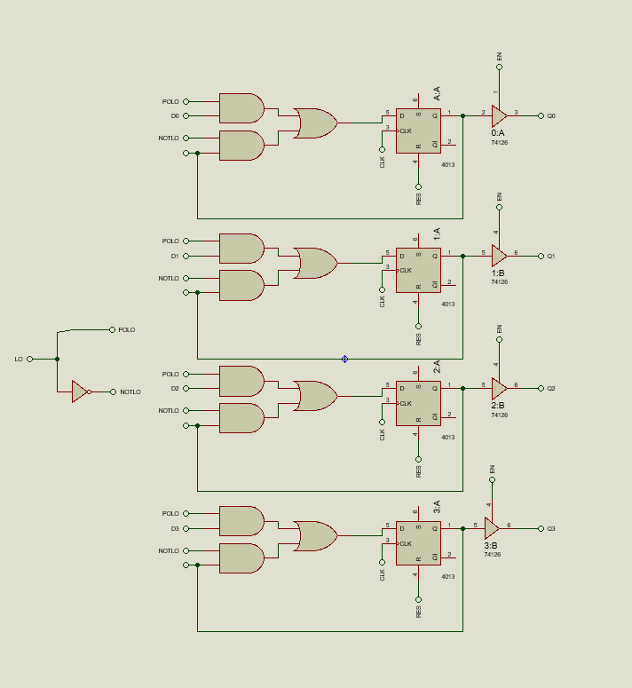
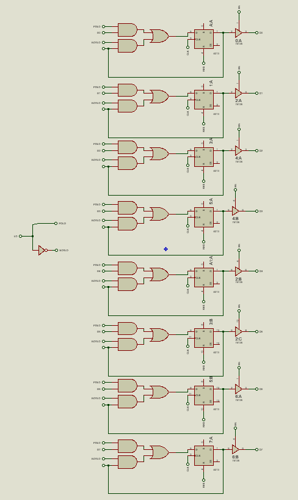
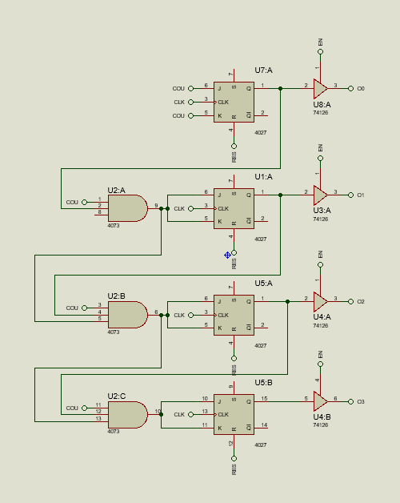

# 🖥️ SAP-1 Computer

## **Overview**
This project is a complete design and implementation of an **SAP-1 computer** using logic gates. It follows the basic architecture principles of early computer systems and serves as a foundational model for understanding how computers process instructions at the hardware level.

The project involves the design and construction of core components **from scratch** using fundamental logic gates and circuits.

## **Features**
- **Arithmetic Logic Unit (ALU)**: Supports basic arithmetic operations such as addition and subtraction.
- **Control Unit:** Manages the execution of instructions and synchronizes data flow.
- **Registers:**
  - 4-bit Register: Used for temporary data storage, such as the Memory Address Register (MAR).  
  - 8-bit Register: Handles larger instructions and data, used for components like the Instruction Register (IR) and others.
- **Program Counter (PC):** Automatically increments to point to the next instruction in memory.
- **Ring Counter:** Generates timing signals for instruction execution.
- **Full Adder:** Handles binary addition with carry operations.
- **Decoder**: Used within the Control Unit to determine the appropriate opcode execution.

## **Technologies Used**
- **Logic Gates** (AND, OR, NOT, NAND, NOR, XOR)
- **Flip-Flops** (JK, D-type)
- **Digital Circuit Design Tools** (Proteus)
- **Basic Electrical Components**: (7-Segment Display, ROM)

## **Usage**
For detailed usage instructions, and setup, please refer to the [USAGE.md](USAGE.md) file.

## **Acknowledgments**
Inspired by the basic computer model from *"Digital Computer Electronics"* by Albert Paul Malvino.

## Project Images

### Full SAP-1 Circuit Design  
  

### Arithmetic Logic Unit (ALU)  
  

### Control Unit  
  

### Ring Counter  
  

### Decoder  
  

### 4-bit Register  
  

### 8-bit Register  
  

### Program Counter  
  

